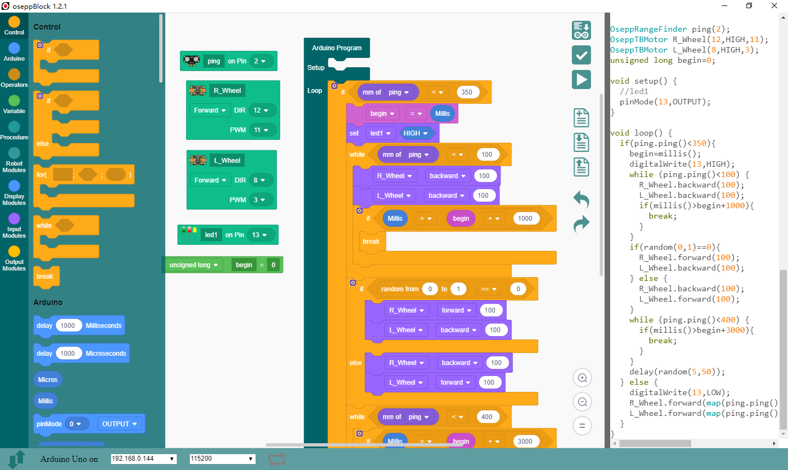

# oseppBlock

 <https://osepp.com/oseppblock-ide>  
 A graphical block system to demystify coding concepts based on the Arduino platform



---

## **Using a precompiled version**

1. Download the corresponding version of your system and unzip it  
 run the oseppBlock program in the directory
2. For linux system, confirm that there is serial port permission  
 or run `sudo gpasswd --add ${USER} dialout`  
 and make sure you have sufficient permissions on the folder
3. For windows, do not put files on the c drive, or the system directory such as desktop
4. If you are using network discovery(for OTA)  
 linux needs package `sudo apt-get -y install libavahi-compat-libdnssd-dev`  
 windows needs to install **Bonjour**  
 *(most systems are pre-installed)*

---

## **Rebuild oseppBlock**

## 1. First install `nodejs`

   Download nodejs from [https://nodejs.org/en/download/](https://nodejs.org/en/download/)

for linux

```bash
        cd $HOME/Downloads #save at HOME/Downloads
        tar -xvf node*tar* #unpack
        cd node*-*-*-*
        sudo ln -s $PWD/bin/node /bin/node
        sudo ln -s $PWD/bin/npm /bin/npm
        echo "export PATH=\$PATH:$PWD/bin"|sudo tee -a /etc/profile
        node -v
        npm -v
        #You should see the version number instead of an error
        sudo reboot
```

  for windows, just download and install it and do not need other configuration

```dos
        node -v
        npm -v
        rem You should see the version number instead of an error
```

## 2. Get *oseppBlock* source code and *closure-library*

Note: *closure-library* should be in the app directory

```bash
        sudo apt-get update&&sudo apt-get -y install git #only need on linux
        cd $HOME
        #for windows , you need to download and install git first
        #then execute the following command in the bash environment
        git clone --depth 1 git://github.com/DIYOSEPP/oseppBlock.git
        cd oseppBlock
        git checkout master
        cd app/
        git clone --depth 1 git://github.com/google/closure-library.git
```

## 3. Install Compiler Dependencies

Confirm that you are still in the source directory oseppBlock/app/  
linux

+ Many linux systems already have python2.7 installed, manually install it if not
+ execute `sudo apt-get -y install libavahi-compat-libdnssd-dev`

windows

+ Download and install Bonjour SDK
+ execute `npm install --global --production windows-build-tools`  
 It will automatically install `msBuildTools` and `python2.7` *(if they are not installed on your system)*  

## 4. Initialize the Node js library

for windows, you need to execute commands in PowerShell, otherwise you need to change '/' to '\\'

```bash
        npm install
        ./node_modules/.bin/electron-rebuild -f #rebulid nodejs modules for electron
        sudo ./node_modules/.bin/electron . #try to run oseppBlock
```

 You should see oseppBlock already running

## 5. Repackaged and released

```bash
        #linux windows
        ./node_modules/.bin/electron-packager . --overwrite --asar --icon=media/osepp.ico  --prune=true --out=../release-builds
        #mac os
        ./node_modules/.bin/electron-packager . --overwrite --asar --icon=media/osepp.icns --prune=true --out=../release-builds
```

 Packaged files will be stored in ../release-builds

## 6. enable the compressed version of *scratch-block*

 it will have a smaller size and faster speed

+ keep only the following folder  
 blockIcon/  
 jQuery/
 media/  
 prettify/  
 scratch-blocks/media/  
 scratch-blocks/msg/  
+ and these files  
 scratch-blocks/arduino_compressed.js  
 scratch-blocks/blockly_compressed_vertical.js  
 scratch-blocks/blocks_compressed.js  
 scratch-blocks/blocks_compressed_vertical.js  
 display.js  
 main.js  
 HWAgent.js
 serial.js  
 package.json  
 serial.js  
 blocklytoolbox.js
+ then edit the `index.html` file  
 Remove the `<!--free` 和 `free-->` tags<font color=#ff0000 size=+1>*(tags only)*</font>  
 Deletes all the <font color=#ff0000 size=+1>*lines*</font> between two `<!--delete-->` tags  
+ repack oseppBlock (follow step 5)

If you want to add your own block, please refer to  
[scratch-block wiki](https://github.com/LLK/scratch-blocks/wiki)  
[Introduction to Blockly](https://developers.google.com/blockly/guides/overview)

## change log

+ 20200104
  1. Built-in arduino-builder (because the arduino-builder included with arduino 1.8.10 IDE is not executable.)
  2. No longer necessary to link to the arduino IDE, so `send code to the arduino` has been canceled and modified to download the INO file.
  3. Added screenshot function to save Blocks as PNG files.
  4. Add some blocks and modify some blocks(from directly generating code to using libraries).So the Arduino IDE needs to install the [oseppRobot](https://github.com/DIYOSEPP/oseppBlock/raw/master/oseppRobot.zip) library to compile the INO file downloaded from oseppBlock.
+ 20190410
  1. Add Chinese support,Usually the display language is the system language,can be specified by adding `locale = [en | zh-cn]` on the command line.
  2. Add jquery ui, separate serial port message and IDE prompt information
  3. add line sensor Block
+ 20180704
  1. add negative Block
  2. change comment Text Font Size
+ 20180626
  1. Updated to the latest **scratch block** core
  2. Update to the latest **electron**
  3. add **robot** blocks and **remote** blocks
  4. add **tcp Serial Monitor**
  5. When the port is an IP address, use **arduino OTA** to upload the sketch (compatible with Arduino Uno Wifi)